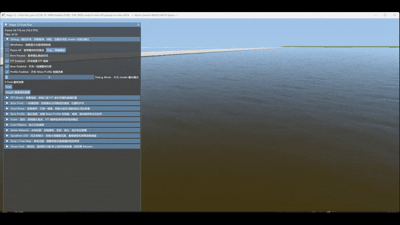

# WaterSurfaceRendererScratch

基于 **Vulkan** 从零搭建的实时水体渲染器，包含：

- 🌊 **多层 FFT 波浪**（Tessendorf 频谱 + GPU 加速）
- 🌪️ **涌潮一线潮**（Bore Front / Wave Profile / Front LUT）
- 🤍 **浪脊泡沫**（三相位细节纹理 + 状态型平流泡沫）
- 🌍 **大规模 LOD**（四叉树 Quadtree，覆盖 2048×2048 m²）
- 🏞️ **弯曲河道支持**（Flow Map / Progress Map / 河床地形）
- ☀️ **类 Fluid Flux 光学**（Beer‑Lambert 吸收、散射、菲涅尔、GGX 高光）
- 🎛️ **ImGui 实时调参**（所有材质、波浪、涌潮参数均可在线调整）

---

## 效果演示（26/08/07）



---

## 环境要求

- **Visual Studio 2022/2026**（需安装 C++ 桌面开发工作负荷）
- **Vulkan SDK**（1.3 及以上）
- **CMake** 3.20+
- **vcpkg**（并已正确配置环境变量）
- **glslc**（Vulkan SDK 自带，用于编译着色器）

---

## 构建步骤

### 1. 克隆仓库

```bash
git clone https://github.com/ArthasXu/WaterSurfaceRendererScratch.git
cd WaterSurfaceRendererScratch
```

### 2. 安装依赖（vcpkg）

```bash
vcpkg install
```

项目根目录下的 `vcpkg.json` 已声明所有必需库（glfw3、glm、spdlog、imgui、fftw3 等），vcpkg 会自动安装它们。

### 3. 生成 CMake 构建系统

```bash
cmake -S . -B build -G "Visual Studio 18 2026" -A x64 -DCMAKE_TOOLCHAIN_FILE=<你的vcpkg路径>\scripts\buildsystems\vcpkg.cmake

e.g. 
cmake -S . -B build -G "Visual Studio 18 2026" -A x64 -DCMAKE_TOOLCHAIN_FILE=D:\vcpkg\scripts\buildsystems\vcpkg.cmake
```

如果你使用的是 Visual Studio 2022，将生成器改为 `"Visual Studio 17 2022"`。

### 4. 编译着色器

```bash
# 河流水面
glslc -I shaders/water shaders/water/stage12_fluid_flux.frag -o shaders/water/stage12_fluid_flux.frag.spv
glslc -I shaders/water shaders/water/stage12_fluid_flux.vert -o shaders/water/stage12_fluid_flux.vert.spv

# 泡沫计算
glslc -I shaders/water shaders/water/foam/foam_advect.comp -o shaders/water/foam/foam_advect.comp.spv
glslc -I shaders/water shaders/water/foam/foam_source.comp -o shaders/water/foam/foam_source.comp.spv

# 河床地形
glslc -I shaders/water shaders/water/terrain.frag -o shaders/water/terrain.frag.spv
glslc -I shaders/water shaders/water/terrain.vert -o shaders/water/terrain.vert.spv

# 天空盒
glslc -I shaders/water shaders/water/sky.vert -o shaders/water/sky.vert.spv
glslc -I shaders/water shaders/water/sky.frag -o shaders/water/sky.frag.spv

# 浪脊飘带（泡沫雾）
glslc -I shaders/water shaders/water/bore_crest.vert -o shaders/water/bore_crest.vert.spv
glslc -I shaders/water shaders/water/bore_crest.frag -o shaders/water/bore_crest.frag.spv
```

### 5. 增量编译 C++ 项目

```bash
cmake --build build --config Debug --parallel
```

---

## 可执行程序列表

项目包含多个**独立可执行文件**，分别对应不同开发阶段的成果，你可以逐个体验：

| 可执行文件 | 功能说明 |
|-----------|----------|
| `.\build\Debug\stage2_triangle.exe` | Vulkan 画彩色三角形 |
| `.\build\Debug\stage3_clear_color.exe` | 动态渐变背景（Clear Color） |
| `.\build\Debug\stage4_textured_quad.exe` | 自转纹理四边形（纹理映射 + UBO） |
| `.\build\Debug\stage5_water_grid.exe` | Gerstner 波叠加的 CPU 水体网格 |
| `.\build\Debug\stage6_fft_cpu_upload.exe` | CPU 端 Tessendorf FFT 水体（纹理上传） |
| `.\build\Debug\stage6_fft_gpu.exe` | GPU FFT 水体（Compute Shader 加速） |
| `.\build\Debug\stage7_bore_front.exe` | 一线潮 Bore Front + Front LUT |
| `.\build\Debug\stage8_bore_profile.exe` | Wave Profile 驱动的涌潮剖面 |
| `.\build\Debug\stage9_water.exe` | 浪潮泡沫 + 水体光学渲染（FFT + Bore + Foam） |
| `.\build\Debug\stage10_river_water.exe` | 四叉树 LOD + U 形河流 + 多潮头系统 + GUI |
| `.\build\Debug\stage11-progress-bore.exe` | Progress Map 驱动潮头 + 水平面噪声 |
| `.\build\Debug\stage12-fluid-flux.exe` | **最新**：类 Fluid Flux 水体光学 + 浪脊飘带 |
| `.\build\Debug\river-field-baker.exe` | **预烘焙**：河流场贴图烘焙工具（带 ImGui 参数编辑器） |

所有程序均支持 **线框模式**（Tab 键切换）、**暂停**（P 键）、**单步**（O 键）以及 **多种调试视图**（F1~F12）。

---

## 代码仓库

- **GitHub**：`https://github.com/ArthasXu/WaterSurfaceRendererScratch`
- 推送命令：
  ```bash
  git push origin main
  git push -u gitlab main
  ```

---

## 许可证

本项目仅供学习与研究使用。
